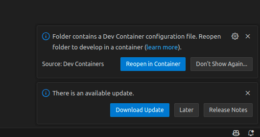
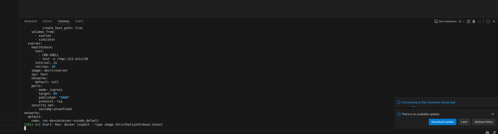
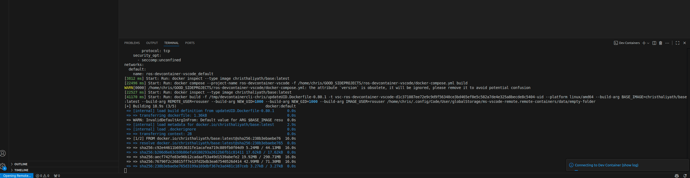
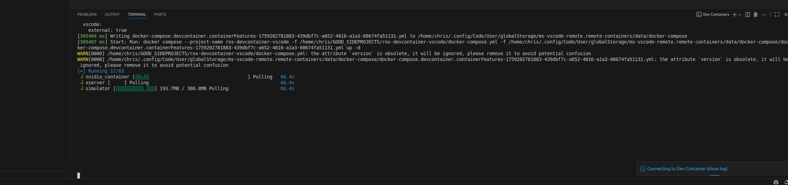

# ROS1 container for Gazebo 

- Jackal robot with 3D Lidar , Camera , Gmapping , MOVE_BASE


# Preparation 







**Then once the container is spwaned properly  use the scripts to do the respective**

# How to use this repository

### To start a basic jackal robot in Gazebo Simulation use this following 

```
./run_jackal_sim.sh

```

### To start a lidar based obstacle detection/clustering node ,use the following script 

```
./run_lidar_obstacle_detector.sh
```

### To start Eucledian Clustering / Hungarian Algorithm 

```
./run_adaptive_clustering.sh

```


### To start ground plane extraction , free space detection  

```
./run_urba_road_filter.sh

```


#### Follow the instructions and install docker 

- https://docs.docker.com/engine/install/ubuntu/
- https://stackoverflow.com/questions/48957195/how-to-fix-docker-got-permission-denied-issue
